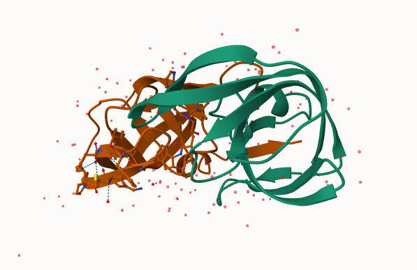
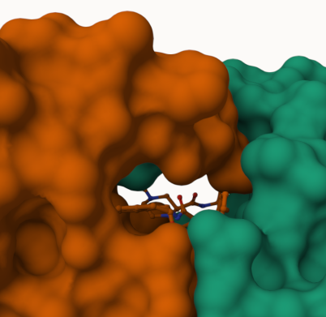
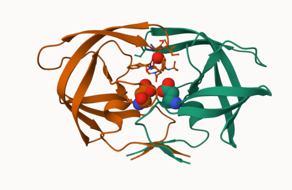

## Background

The main repository of high-resolution structural data on biomlecules is called the **Protein Data Bank** (PDB)

## PDB statistics

What is in the PDB in terms of molecule type and structure determination method?

Read a CSV file of current PDB stats from 
https://www.rcsb.org/stats/summary

```{r}
pdb <- read.csv("Data Export Summary.csv")
pdb
```

>Q1: What percentage of structures in the PDB are solved by X-Ray and Electron Microscopy.

```{r}
pdb$X.ray
```

The print out above `pdb$X.ray` is "character" not "numeric" Therefore I can't do math with it. We need to fix this...

Two functions that can help here are `sub()` and `as.numeric()`
```{r}
# We want to get rid (or sub out) commas
x <- pdb$X.ray
tmp <- sub( ",", "", x)
sum(as.numeric(tmp))
```

We could make a function to do this:

```{r}
rm.comma <- function(x) {
  tmp <- sub( ",", "", x)
sum(as.numeric(tmp))
}
```


```{r}
rm.comma(pdb$EM)
```

We could aso use a different import function for this CSV that speaks American (i.e. deals with commas in numbers in a comma seperated value file).

```{r}
library(readr)

pdb <- read_csv("Data Export Summary.csv")
pdb
```

```{r}
n.tot <- pdb$Total
sum(pdb$`X-ray`) / n.tot
```

```{r}
n.tot <- sum(pdb$Total)
n.xray <- sum(pdb$`X-ray`)
n.em <- sum(pdb$EM)

n.xray/n.tot*100
n.em/n.tot*100
```

>Q. How many total protein structures are there in the dataset?

```{r}
pdb$Total[1]
```

The total number of protein sequences in UniProt is 202,556,314

```{r}
217375/202556314 *100
```

> **Key-point**: We have a very, very small structual coverage of known proteins (~0.1%). Most structures we know about (~80%) come from one method (X-ray crystalography).

## Visualizing PDB data with Mol-star

Main stand alone web version with all features is at 
https://molstar.org/viewer/







# Getting started with the Bio3D package

Bio3D is an R package from CRAN for structural bioinformatics

```{r}
library(bio3d)

pdb <- read.pdb("1hsg")
pdb
```

```{r}
attributes(pdb)
```
```{r}
head(pdb$atom)
```

There are lots of functions that can work with these `pdb` objects

```{r}
head(pdbseq(pdb))
```

We can have a quick interactive view of any of these `pdb` objects:

```{r}
library(bio3dview)

#view.pdb(pdb)
```


Lets try a custom view
```{r}

```

> Q. Create a custom view of HIV-Pr highlighting the active site (`resno=25`), the two chains (in your choice of colors), and the ligand all on a custom color background?

```{r}
library(NGLVieweR)
# active.site <- atom.select(pdb, rsno=25)

# view.pdb(pdb, 
#          cols = c("red","blue"),
#          highlight = active.site,
#          highlight.style = "spacefill",
#          backgroundColor = "pink") %>%
#   setRock()
```

Predicting functional motions of a single structure

```{r}
adk <- read.pdb("6s36")
adk
```

```{r}
m <- nma(adk)
plot(m)
```

```{r}
mktrj(m, file="adk_m7.pdb")
# view.nma(m, pdb=adk)
```

## Comparative structure analysis of Adenylate Kinase

```{r}
## Install packages in the R console NOT your Rmd/Quarto file

#install.packages("bio3d")
#install.packages("NGLVieweR")

#install.packages("remotes")
#remotes::install_github("bioboot/bio3dview")

#install.packages("BiocManager")
#BiocManager::install("msa")
```


>Q10. Which of the packages above is found only on BioConductor and not CRAN?

The package `"msa"` is only found on BioConductor

>Q11. Which of the above packages is not found on BioConductor or CRAN?

`"bio3dview"` is not found on BioConductor or CRAN.

>Q12. True or False? Functions from the `pak` package can be used to install packages from GitHub and BitBucket?

True


Search and retrieve ADK structures

```{r, message=FALSE}
library(bio3d)
aa <- get.seq("1ake_A")
#aa
```

>Q13. How many amino avids are in this sequence?

There are 214 amino acids.

Aligning and superposing structures

```{r}
hits <- NULL
hits$pdb.id <- c('1AKE_A','6S36_A','6RZE_A','3HPR_A',
                 '1E4V_A','5EJE_A','1E4Y_A','3X2S_A',
                 '6HAP_A','6HAM_A','4K46_A','3GMT_A',
                 '4PZL_A')
```

```{r, warning=FALSE, message=FALSE}
# Download releated PDB files
files <- get.pdb(hits$pdb.id, path="pdbs", split=TRUE, gzip=TRUE)
```

```{r, message=FALSE}
# Align releated PDBs
pdbs <- pdbaln(files, fit = TRUE, exefile="msa")
```

Annotating PDB structures

```{r}
# Vector containing PDB database codes
ids <- basename.pdb(pdbs$id)

anno <- pdb.annotate(ids)
unique(anno$source)
```


Principal Component Analysis

```{r}
# Perform PCA
pc.xray <- pca(pdbs)
plot(pc.xray)
```
```{r}
# Calculate RMSD
rd <- rmsd(pdbs)

# Structure-based clustering
hc.rd <- hclust(dist(rd))
grps.rd <- cutree(hc.rd, k=3)

plot(pc.xray, 1:2, col="grey50", bg=grps.rd, pch=21, cex=1)
```

```{r}
# Visualize first principal component
pc1 <- mktrj(pc.xray, pc=1, file="pc_1.pdb")
```

```{r}
#Plotting results with ggplot2
library(ggplot2)
library(ggrepel)

df <- data.frame(PC1=pc.xray$z[,1], 
                 PC2=pc.xray$z[,2], 
                 col=as.factor(grps.rd),
                 ids=ids)

p <- ggplot(df) + 
  aes(PC1, PC2, col=col, label=ids) +
  geom_point(size=2) +
  geom_text_repel(max.overlaps = 20) +
  theme(legend.position = "none")
p
```

