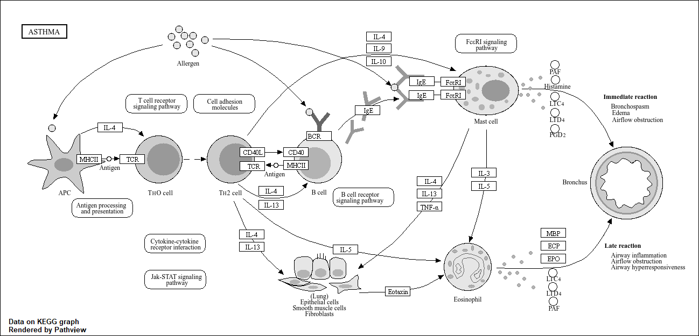
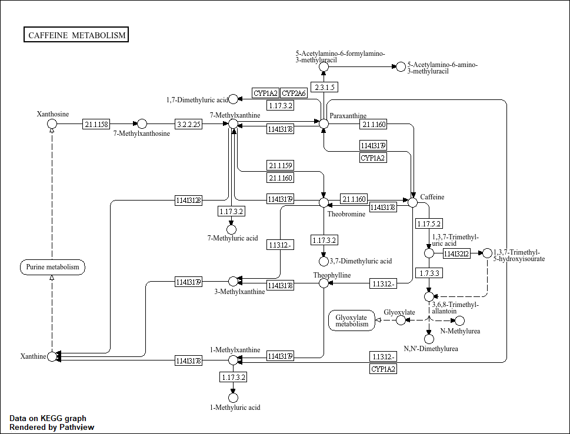
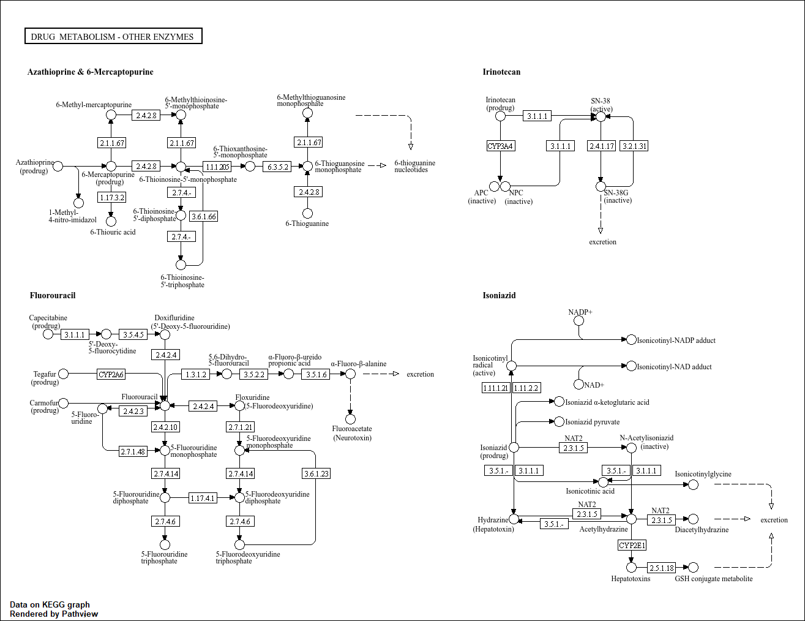

## Background
Today we're going to do an RNA-seq analysis of a data set on the common glucocorticoid steroid dexamethasone (Dex), and we'll use DESeq for this analysis.

## Data Import

Let's read the `count` data and `metadata` about this experiment setup from the supplied CSV files:

```{r}
# Complete the missing code
counts <- read.csv("airway_scaledcounts.csv", row.names=1)
metadata <-  read.csv("airway_metadata.csv")
```

Have a peek at the data:
```{r}
head(counts)
```

And the metadata that tells us what is actually in te columns of our `counts` object:

```{r}
metadata
```

>Q1. How many genes are in this dataset? 

There are `r nrow(counts)` genes in this dataset

>Q2. How many ‘control’ cell lines do we have?

```{r}
sum(metadata$dex=="control")
```


```{r}
ncol(counts)
```
```{r}
colnames(counts)
```

- Find the "control" columns in our `counts` object
- Extract just the "control" column values for all genes
- Calculate the average value per gene in these "control" columns

```{r}
control.inds <- metadata$dex == "control"
control.counts <- counts[,control.inds]
control.mean <- rowMeans(control.counts)
```


The same but for treated columns

```{r}
treated.mean <- rowMeans( counts[, metadata$dex == "treated"])
```

For book-keeping let's store these together as a new object called `meancounts`
```{r}
meancounts <- data.frame(control.mean, treated.mean)
head(meancounts)
```

Make a plot of `control.mean` vs `treated.mean`

```{r}
plot(control.mean, treated.mean)
```

Our count data is highly skewed and when we see a pattern like this plot it screams log transform

```{r}
plot(meancounts, log="xy")
```

We most often use log2 transform for this kind of data in bioinformatics because it makes the interpretation easier

```{r}
#Treated / Control

log2( 20 / 20 )
log2( 40 / 20 )
log2( 10 / 20 )
log2( 80 / 20 )
```

We call this fraction the **"log2 fold change"** as it tells us how much more or less gene exptression we have in units of doubling, etc.

Let's calculate the log2 fold change for our `treated.mean` and `control.mean` counts and call this `log2fc`.

```{r}
meancounts$log2fc <- log2(meancounts$treated.mean / 
                            meancounts$control.mean)
head(meancounts)
```

A common "rule of thumb" threshold for calling a gene "up regulated" or "down regulated" is a log2 fold-change value of +2 or -2 (or greater)

```{r}
zero.vals <- which(meancounts[,1:2]==0, arr.ind=TRUE)

to.rm <- unique(zero.vals[,1])
mycounts <- meancounts[-to.rm,]
head(mycounts)
```


>Q7. What is the purpose of the arr.ind argument in the which() function call above? Why would we then take the first column of the output and need to call the unique() function?

arr.ind tells which() to return the positions of matching values as row and column indices. unique() is used since rows may contain multiple zeros, so it removes duplicate row indices.


```{r}
up.ind <- mycounts$log2fc > 2
down.ind <- mycounts$log2fc < (-2)
```

>Q8. Using the up.ind vector above can you determine how many up regulated genes we have at the greater than 2 fc level? 

```{r}
sum(up.ind)
```


## DESeq analysis

Let's do this analysis properly and not forget about the significance of the differences

For this we will use the **DESeq2** package

```{r, message=FALSE}
library(DESeq2)
```

To run a DESeq analysis we need at least two inputs:

- `countData` i.e. are gene counts across different experiments
- `colData` i.e. our metadata about those count columns

```{r, warning=FALSE}
dds <- DESeqDataSetFromMatrix(countData = counts,
                              colData = metadata,
                              design = ~dex)
```

Now we can run the DEseq analysis pipeline using this `dds` object that has all the inputs we need.

```{r}
dds <- DESeq(dds)
res <- results(dds)
head(res)
```


## Volcano plot

This is a ubiquitous and common visualization for this type of data that puts the log fold change and the adjusted p-value together in one plot that people can get insight for wat is going on in the whole dataset results.

```{r}
library(ggplot2)
```

```{r}
ggplot(res) +
  aes(log2FoldChange, padj) +
  geom_point(alpha=0.3)
```

That plot is not very useful because we don't care about genes with high p-values, we want the very low values below our alpha threshold (e.g. 0.01)

Let's log the y-axis so we can see these genes/points more clearly

```{r}
ggplot(res) +
  aes(log2FoldChange, log(padj)) +
  geom_point(alpha=0.3)
```

We need to flip the y-axis so our "volcano" is not upside down

```{r}
ggplot(res) +
  aes(log2FoldChange, -log(padj)) +
  geom_point()
```

>Q. Add annotation to this volcano plot including the log2 fold-cange thresholds of +2 and -2 and the p-value threshold of 0.05. Also color up just the genes that meet both these thresholds.

```{r}
# Setup our custom point color vector 
mycols <- rep("gray", nrow(res))
mycols[ abs(res$log2FoldChange) > 2 ]  <- "red" 

inds <- (res$padj < 0.01) & (abs(res$log2FoldChange) > 2 )
mycols[ inds ] <- "blue"

# Volcano plot with custom colors 
plot( res$log2FoldChange,  -log(res$padj), 
 col=mycols, ylab="-Log(P-value)", xlab="Log2(FoldChange)" )

# Cut-off lines
abline(v=c(-2,2), col="gray", lty=2)
abline(h=-log(0.1), col="gray", lty=2)
```


## Save our results to date

```{r}
write.csv(res, file="myresults.csv")
```

## Pathway analysis with R and BioConductor

```{r}
library(pathview)
library(gage)
library(gageData)

data(kegg.sets.hs)

# Examine the first 2 pathways in this kegg set for humans
head(kegg.sets.hs, 2)
```

```{r}
foldchanges = res$log2FoldChange
names(foldchanges) = res$entrez
head(foldchanges)
```

```{r}
# Get the results
keggres = gage(foldchanges, gsets=kegg.sets.hs)
attributes(keggres)
head(keggres$less)
```

```{r}
pathview(gene.data=foldchanges, pathway.id="hsa05310")
```



```{r}
# Look at the first three down (less) pathways
head(keggres$less, 3)
```

```{r}
pathview(gene.data=foldchanges, pathway.id="hsa05310")
```


>Q12. Can you do the same procedure as above to plot the pathview figures for the top 2 down-reguled pathways?

```{r}
pathview(gene.data=foldchanges, pathway.id="hsa00232")
pathview(gene.data=foldchanges, pathway.id="hsa00983")
```




